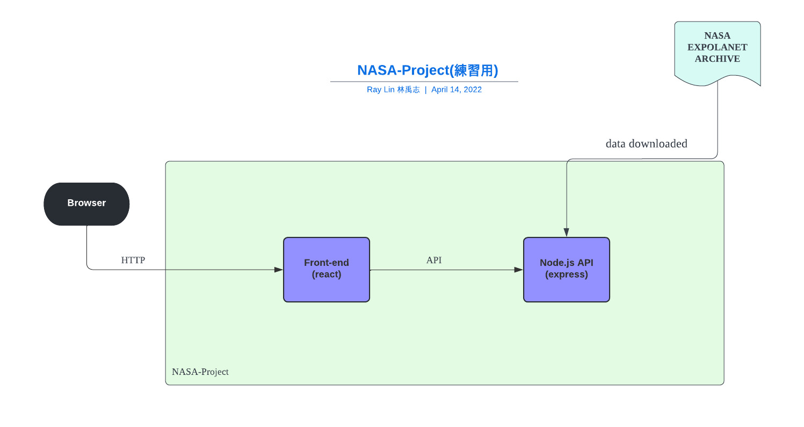
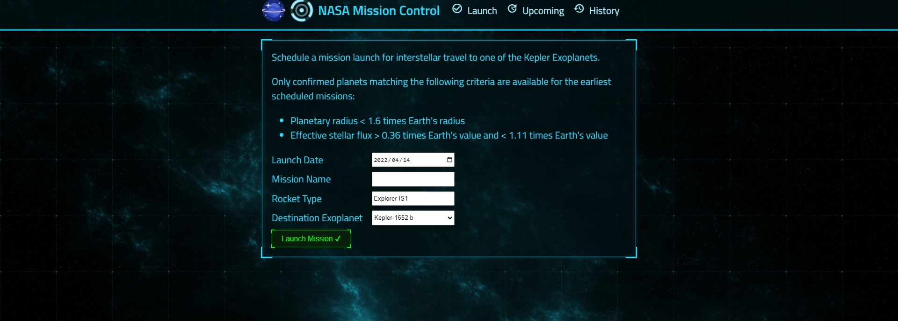

# NASA-Project
## 架構圖

## 介面

覺得這個太空的介面蠻好看的~ (使用 `arwes` )

## 簡單筆記紀錄

前端的部分是附上的，主要為練習 Node.js (express) 用
有練習到了：
- express Middleware
- API setting
- logging 
- CORS setting
- MVC 設計
- SPA routing 

